<!-- Terminal-style profile. The SVGs in ./assets are regenerated daily from real
     GitHub data by .github/workflows/profile-art.yml — edit profile.json, not the SVGs. -->

<h3><code>juan@github ~ $ ./contributions.sh</code></h3>

  

<h3><code>juan@github ~ $ whoami</code></h3>

<table>
<tr>
<td valign="top"></td>
<td valign="top"></td>
</tr>
</table>

 

<h3><code>juan@github ~ $ cat about.md</code></h3>

- 🧩 I design **frontend experiences** that prioritize consistency, responsiveness, and reusable component systems.
- 🧱 I build **backend services and APIs** with clear contracts, solid domain modeling, and maintainable architecture.
- 🤖 I automate the boring stuff: **RPA, web scraping and data pipelines** that run reliably in production.
- 🎯 I care about **product quality** as much as implementation — performance, usability, and delivery speed.
- 🎓 Currently pursuing an **MSc in AI & Data Science**.
- 🌎 Based in **Colombia**, open to collaborating on ambitious digital products.

 

<h3><code>juan@github ~ $ ls ~/stack</code></h3>

<table>
  <tr>
    <td align="center" width="33%">
      <h4>🎨 frontend/</h4>
      
        
      
      
      
Reusable components, consistent state and user-focused interfaces.

    </td>
    <td align="center" width="33%">
      <h4>🧪 backend/</h4>
      
        
      
      
      
Clear endpoints, well-modeled domains and client-friendly responses.

    </td>
    <td align="center" width="33%">
      <h4>🛠 devops/</h4>
      
        
      
      
      
Clear pipelines, reproducible environments and tested APIs before production.

    </td>
  </tr>
</table>

 

<h3><code>juan@github ~ $ ./links.sh</code></h3>

<b>Full Stack Developer · Automation · Data</b>

<!-- Portfolio: uncomment and set your URL

-->

 

<code>juan@github ~ $ exit</code> — open to building thoughtful products, strong engineering teams, and web experiences users actually enjoy.

